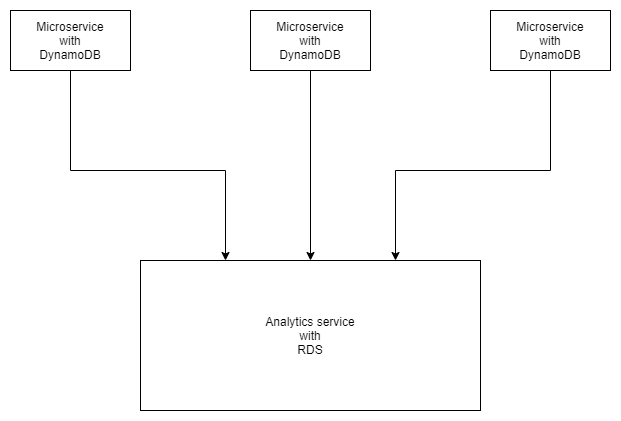

# Transactions demo

  A minimal service with importing feature and basic error handling but fully managed by AWS

## Deployment

  Deployment is fully handled by serverless, here are some ways to deploy:

  - from terminal  
    run `npx sls deploy` or `npx sls deploy --stage "YOURSTAGE"`

  - from terminal, but only the frontend  
    run `npx sls s3deploy` or `npx sls s3deploy --stage "YOURSTAGE"`

  - from docker  
    run `npm run deploy` or `npm run deploy -- --stage "YOURSTAGE"`  
    If you go with this options make sure you have a `.env` file with the aws keys for deployment: `AWS_DEFAULT_REGION`, `AWS_ACCESS_KEY_ID`, `AWS_SECRET_ACCESS_KEY`

## Testing

  `npm test` will run the tests in a docker container matching the target node version

## Frontend

  The frontend is very minimal and does not use cognito for the S3 uploads. Therefore there are 2 text inputs one for the aws key and another for the secret. The credentials need listing and uploading access to the importer bucket of this service.

## The Design

  The service has been designed by focusing on performance on one side. Therefore it uses concurrency and parallelism.  
  On another side cost efficency is also taken into account, therefore it uses dynamodb and lambdas.

  DynamoDB is an especially good choice if you want to combine performance and cost efficiency for simple applications, like a microservice.
  
### The performance

  - It uses parallelism to insert items into the dynamodb and the failed ones can end up in the error queue for manual resolution (or AI).
  - Dynamodb with the correct usage can be incredibly fast which means that the REST API operations can be quick, leading to a very responsive user experience.

### The costs

  DynamoDB is fully managed database service and with simple data it can perform very well for a very low cost. And most importantly when it's idling (so it does not receive any requests) it costs virtually nothing. As opposed to an RDS service where you need to pay a minimum cost even when it's standing by. 

  Which is also true for lambda, they virtually cost nothing when the application is standing by. As opposed to running EC2s, even with scaling, you have to pay at least after the minimum scale size.

  So (if we exclude the RDS) the application costs virtually nothing when it does nothing! You only pay for the usage, you don't pay for the standby!

  And does it without sacrificing any performance!

### The flow

  

  1. The user uploads a file to the S3 bucket through the frontend
  2. The S3 bucket puts a message into the file queue with the filename
  3. The first lambda retrieves the contents of the file 
  4. Then splits it by lines and puts each line into the item queue concurrently
  5. This is where concurrency turns into parallelism. The queue calls a lambda for each item in parallel.
  6. The second lambda converts the csv line into an object format that can be used throughout the application
  7. The same lambda then inserts the object into the dynamodb
  8. The dynamodb emits a message on its own stream for the new items (this works in batches)
  9. A migrator lambda listens in that stream and migrates the items into the postgresql database

### Analytics

  Although DynamoDB is perfect for storing simple domain-only data, it is not a good choice for analytics. For that SQL based databases usually perform better. For demo reasons an RDS database is included in this stack.  
  Ideally the RDS database is external and would be imported through cloudformation exports.
  
  In a multi microservice environment each microservice would put it's own segment of data to the RDS.

  

### Access patterns

  The DynamoDB of this application uses access patterns (AP) to retrieve the data.

  It has 1 GSI, which in reality acts as a second database with the same data, but with a different AP than the table itself.

  This way the data can be retrieved concurrently improving response times.
  
  In this application the main AP is done by partitioning by the 'party' and sorting by the 'date', so the data can be queried by the 'party' and can be filtered by the 'date'.

  The secondary AP is done by partitioning by the 'counterparty' and sorting by the 'date', so the data can be queried by the 'counterparty' and can be filtered by the 'date'.

  When calculating daily positions for an entity and for a specific day the entity and the date is supplied. Then the lambda queries both the main table and the GSI concurrently. The first set of results will be the items where the entity was the party and the second one will be the items where it was the counterparty. Then it calculates the daily position with the 2 sets of data.

## Caveats

  - The service cannot handle too big files due to the limitations of Lambda  
    Currently lambda has 15 minute and 3 gig ram limitation. As a result it cannot read big files in one go. There are different ideas to solve it:
    - retrieve file by small segments sequentially  
      This allows to overcome the memory limitations, but still has a time limit. Also due to the segments the last line of data will be cut in half and the second half of that line will be in the next segment. Causing the data to be fragmented and handling those fragments can be fiddly.
    - retrieve file by small segments and put it in another queue for parallel processing  
      This both allows to overcome both the memory and time limit and also improves performance for big files, however requires another queue+lambda solution to be present. Also it has the same problem with fragmentation as the previous solution.
      With insanely huge files this can timeout as well, but for such situation a simple service such this shouldn't be used.
    - Use ElasticBeanstalk Worker tier  
      EB worker is fully managed and can run nodejs. This allows to overcome both the memroy and time limitation, since here both are virtually infinite. Although this is more costly, since EB has to run at least 1 instance all the time and with a huge instance it could result a pricey minimal running cost, even when not processing a thing.